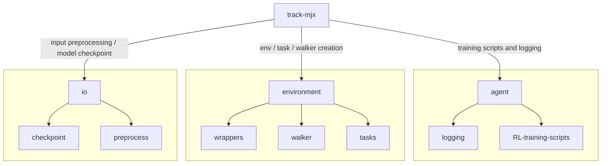

The following document provides a brief overview of the `track-mjx` package.

## Higher level design
Track-mjx has been designed to be as flexible as possible, allowing the user to train models with different network architectures, learning algorithms, and a variety of different experiment configurations. It is built to support *in virtual neuroscience experiments* across different bio-mechanically realistic animal models and motion capture registrations that the user specifies. The following sections will provide a brief overview of the higher level structure of the package:




## Training pipeline & software stacks

```
```