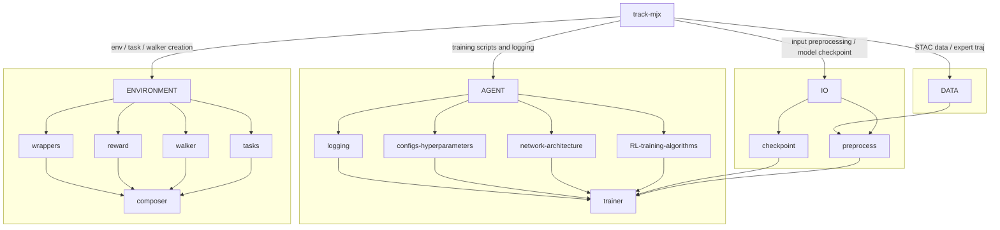

```mermaid
graph TD
    track-mjx -- STAC data / expert traj --> DATA
    track-mjx -- training scripts and logging --> AGENT
    track-mjx -- env / task / walker creation  --> ENVIRONMENT
    track-mjx -- input preprocessing / model checkpoint --> IO

    subgraph " "
    DATA
    end

    subgraph " "
    AGENT --> logging --> trainer
    AGENT --> configs-hyperparameters --> trainer
    AGENT --> network-architecture --> trainer
    AGENT --> RL-training-algorithms --> trainer
    end

    subgraph " "
    ENVIRONMENT --> wrappers --> composer
    ENVIRONMENT --> reward --> composer
    ENVIRONMENT --> walker --> composer
    ENVIRONMENT --> tasks --> composer
    end

    subgraph " "
    DATA --> preprocess
    IO --> checkpoint --> trainer
    IO --> preprocess --> trainer
    end

```