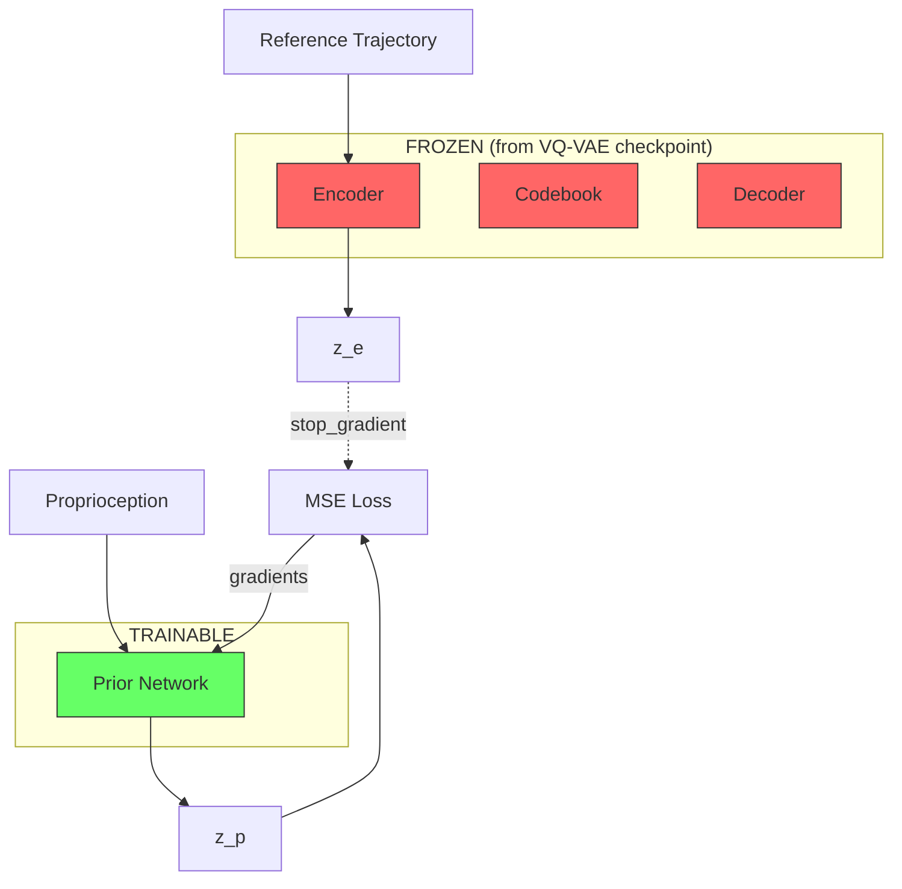
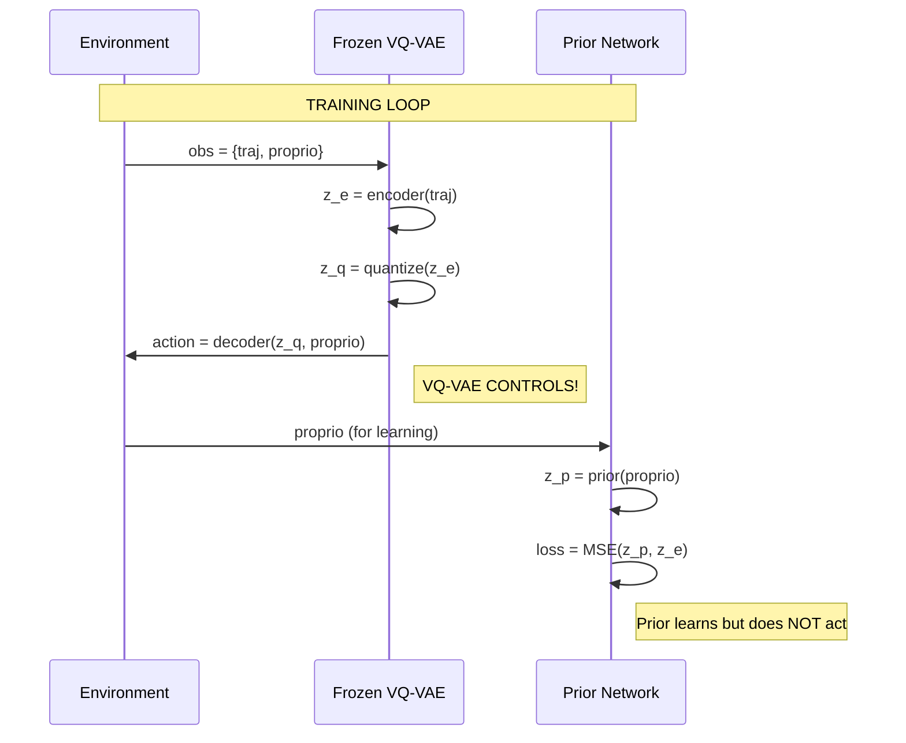
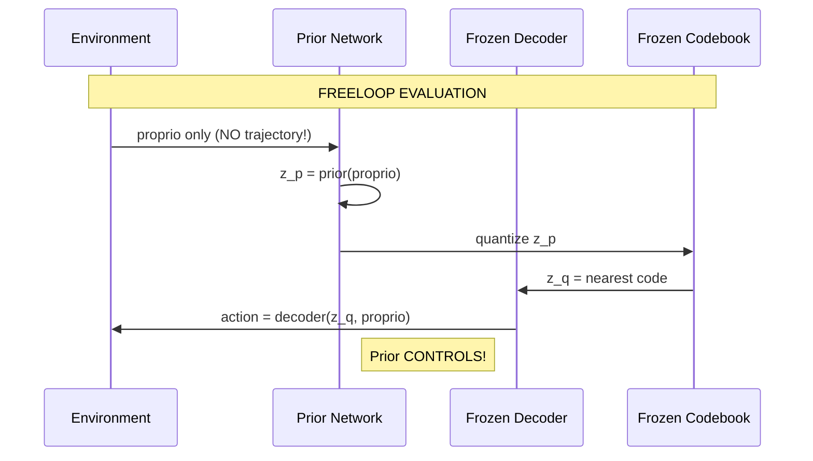
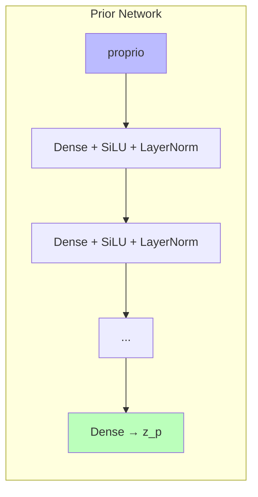

# VQ-VAE Prior Distillation

This document describes the VQ-VAE Prior Distillation module, which trains a Prior network to predict VQ-VAE encoder outputs from proprioceptive observations only, enabling "freeloop" generation without reference trajectories.

## Motivation

The VQ-VAE system learns discrete motor primitives for motion imitation:

```
Reference Trajectory → Encoder → z_e → Quantizer → z_q → Decoder + Proprio → Action
```

However, at inference time we want to generate motion **without reference trajectories**. The Prior Distillation module solves this by training a Prior network to predict encoder outputs from proprioception alone.

## Architecture Overview



**Key Principle**: Only the Prior network receives gradients. The VQ-VAE components (encoder, decoder, codebook) are frozen and loaded from a pretrained checkpoint.

## Critical Design: Who Controls the Rodent?

Understanding when each component controls the environment is essential:

### During Training



**During training, the frozen VQ-VAE controls the rodent.** The Prior network only learns to predict z_e - it never generates actions that affect the environment.

### During Freeloop Evaluation



**During freeloop evaluation, the Prior controls the rodent.** No reference trajectory is used - the Prior generates latent codes from proprioception alone.

## Training Pipeline

```mermaid
flowchart TD
    A[Load VQ-VAE Checkpoint] --> B[Freeze Encoder/Decoder/Codebook]
    B --> C[Initialize Prior Network]
    C --> D[Training Loop]

    subgraph D[Training Loop]
        D1[Reset Environment] --> D2[Collect Data with Frozen VQ-VAE]
        D2 --> D3[Extract proprio, z_e pairs]
        D3 --> D4[Forward: z_p = Prior(proprio)]
        D4 --> D5[Loss = MSE(z_p, stop_grad(z_e))]
        D5 --> D6[Update Prior params only]
        D6 --> D7{Eval interval?}
        D7 -->|Yes| D8[Run Freeloop Evaluation]
        D7 -->|No| D1
        D8 --> D9[Log to wandb]
        D9 --> D1
    end
```

### Step-by-Step Training Flow

1. **Initialization**
   - Load frozen VQ-VAE from checkpoint (encoder, decoder, codebook)
   - Initialize fresh Prior network (random weights)
   - Create optimizer for Prior params ONLY

2. **Data Collection** (VQ-VAE controls)
   - Reset environment to random clip position
   - VQ-VAE policy generates actions
   - Store (proprio, z_e) pairs for training

3. **Prior Training** (supervised learning)
   - Forward: `z_p = prior(proprio)`
   - Loss: `MSE(z_p, stop_gradient(z_e))`
   - Backward: gradients flow ONLY to Prior
   - Update Prior params via optimizer

4. **Evaluation**
   - Standard eval (VQ-VAE policy, sanity check)
   - Freeloop eval (Prior controls, key metric)
   - Log metrics and videos to wandb

## Loss Functions

The module provides multiple alignment loss options:

### Primary: MSE Loss (Default)

```python
loss = mean((z_p - stop_gradient(z_e))²)
```

Mean squared error between Prior prediction and encoder output.

### Alternative Losses

| Loss Type | Formula | Use Case |
|-----------|---------|----------|
| **MSE** | `mean((z_p - z_e)²)` | Default, standard regression |
| **L2** | `mean(‖z_p - z_e‖₂)` | Per-sample norm, more sensitive to large deviations |
| **Smooth L1** | Huber loss | Less sensitive to outliers |
| **Cosine** | `mean(1 - cos(z_p, z_e))` | Focus on direction, not magnitude |
| **Combined** | `MSE + λ·Cosine` | Balance magnitude and direction |

### Optional: AR(1) Temporal Smoothness

Encourages smooth Prior predictions over time:

```python
ar_loss = mean(‖z_p[t] - φ·z_p[t-1]‖₂)  # φ = 0.99
```

Masked at episode boundaries (discount=0).

### Total Loss

```python
total_loss = alignment_loss + ar_weight * ar_loss
```

## Network Architecture

### Prior Network

The Prior is an MLP that maps proprioception to latent embeddings:



**Architecture Details:**
- Input: Proprioceptive observations `[batch, proprio_dim]`
- Hidden layers: Configurable (default: `[1024, 1024, 512, 512]`)
- Activation: SiLU (Swish)
- Normalization: LayerNorm after each hidden layer
- Output: Latent embedding `[batch, latent_dim]` (no activation)

### Frozen VQ-VAE Components

Loaded from checkpoint, never updated:

| Component | Input | Output |
|-----------|-------|--------|
| **Encoder** | Reference trajectory | `z_e` continuous embedding |
| **Codebook** | `z_e` | `z_q` nearest discrete code |
| **Decoder** | `z_q` + proprio | Action distribution params |

## Freeloop Evaluation

Freeloop evaluation tests whether the Prior can control the rodent without reference trajectories:

```mermaid
flowchart LR
    subgraph Freeloop
        R[Reset to clip position] --> L1
        subgraph L1[Rollout Loop]
            P[Prior: z_p = f(proprio)]
            Q[Quantize: z_q = nearest(z_p)]
            D[Decode: action = decoder(z_q, proprio)]
            S[Step: next_state = env.step(action)]
            P --> Q --> D --> S
            S -->|not done| P
        end
        L1 --> M[Metrics]
    end
```

### Metrics Logged

| Metric | Description |
|--------|-------------|
| `freeloop/avg_survival_steps` | Average steps before termination |
| `freeloop/termination_rate` | Fraction of rollouts that terminated early |
| `freeloop/unique_codes_used` | Codebook diversity |
| `freeloop/perplexity` | Effective codebook size used |
| `videos/freeloop_best` | Video of best rollout |

## Gradient Flow

Understanding gradient flow is critical for correctness:

```
                    FORWARD PASS                      BACKWARD PASS
                    ────────────                      ─────────────

    traj ──────────► [ENCODER] ──────► z_e           ✗ No gradients
                      (frozen)          │
                                        │ stop_gradient()
                                        ▼
    proprio ───────► [PRIOR] ────────► z_p ◄──────── ✓ Gradients flow here
                    (trainable)         │
                                        ▼
                                   MSE(z_p, z_e)
                                        │
                                        ▼
                                  ∂Loss/∂prior_params  ← Only Prior updated!
```

**Protection Mechanisms:**
1. `jax.lax.stop_gradient(z_e)` - Explicit gradient stop on encoder output
2. `argnums=0` in `jax.grad` - Only differentiate w.r.t. Prior params
3. Optimizer initialized with Prior params only

## Configuration

### Hydra Config Structure

```yaml
# VQ-VAE checkpoint (frozen)
vqvae_config:
  checkpoint_path: /path/to/vqvae/checkpoint
  checkpoint_step: null  # null = latest

# Prior network architecture
network_config:
  prior_layer_sizes: [1024, 1024, 512, 512]

# Loss configuration
loss_config:
  loss_type: mse  # mse, l2, smooth_l1, cosine, combined
  ar_weight: 0.0  # AR(1) temporal smoothness
  phi: 0.99

# Freeloop evaluation
freeloop_config:
  enabled: true
  num_rollouts: 32
  max_steps: 200
  quantize_prior: true
```

### Training Hyperparameters

| Parameter | Default | Description |
|-----------|---------|-------------|
| `learning_rate` | 3e-4 | Higher than RL (supervised learning) |
| `grad_clip_norm` | 20.0 | Gradient clipping |
| `num_timesteps` | 500M | Less than VQ-VAE (simpler task) |
| `batch_size` | 1024 | Minibatch size |

## Usage

### Training

```bash
cd vqvae_jax/distillation
python train_vq_prior.py vqvae_config.checkpoint_path=/path/to/checkpoint
```

### Override Config Values

```bash
python train_vq_prior.py \
    vqvae_config.checkpoint_path=/path/to/checkpoint \
    loss_config.loss_type=l2 \
    train_setup.train_config.learning_rate=1e-4
```

## File Structure

```
vqvae_jax/
├── distillation/                 # Prior distillation module
│   ├── __init__.py               # Package exports
│   ├── vq_prior_losses.py        # Loss functions (MSE, L2, Smooth L1, etc.)
│   ├── vq_prior_networks.py      # VQPrior network and factories
│   ├── vq_prior_distill.py       # Main training pipeline
│   ├── vq_prior_rollout.py       # Freeloop evaluation + wandb logging
│   └── train_vq_prior.py         # CLI entry point
├── configs/
│   └── vq_prior_distill.yaml     # Hydra configuration
├── vq_intention_network.py       # VQ-VAE networks (encoder, decoder, quantizer)
├── vq_losses.py                  # VQ-VAE training losses
└── train_vqvae.py                # VQ-VAE training entry point
```

## Comparison: VAE vs VQ-VAE Prior Distillation

| Aspect | VAE (mlp_distill) | VQ-VAE (vq_prior_distill) |
|--------|-------------------|---------------------------|
| **Encoder Output** | (μ, logσ²) distribution | z_e single embedding |
| **Prior Output** | (μ_p, logσ²_p) distribution | z_p single embedding |
| **Alignment Loss** | KL(encoder ‖ prior) | MSE(z_p, z_e) |
| **Sampling** | Reparameterization trick | Nearest codebook lookup |
| **Inference** | Sample from prior distribution | Quantize prior output |

## Key Insights

1. **Frozen Teacher**: The VQ-VAE serves as a fixed "teacher" that provides stable targets (z_e) for the Prior to learn.

2. **Distribution Matching**: The Prior learns to produce embeddings that, when quantized, map to the same codes as the encoder would produce.

3. **Supervised Learning**: Unlike RL, this is pure supervised learning - the Prior minimizes MSE to match encoder outputs.

4. **No Distribution Shift**: Training data comes from running the frozen VQ-VAE policy, ensuring the Prior learns the actual state distribution.

5. **Freeloop = True Test**: The real test is freeloop evaluation - can the Prior control the rodent without any reference trajectory?
